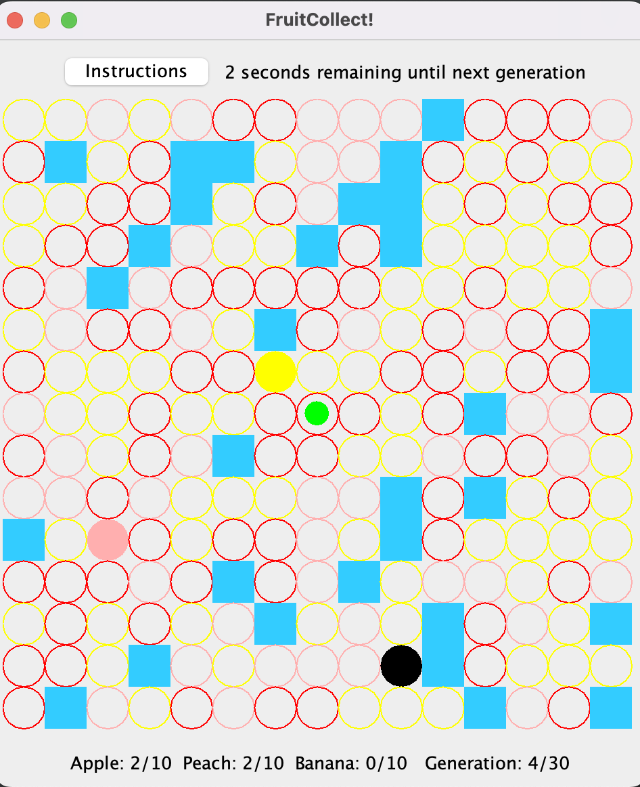

# Fruit Collect Game

A grid-based desktop game where the player (green dot) uses the arrow keys to go around the board to collect 3 different types of fruits (colored circles) while avoiding falling into the ponds (blue squares). If a fruit is not collected at the end of its generation, it becomes poisonous (black) and deadly for the player too. Build locally and play!

